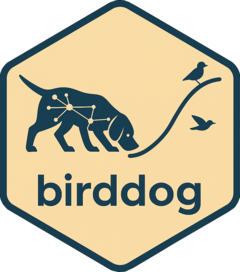

<!-- README.md is generated from README.Rmd. Please edit that file -->

```{r, include = FALSE}
knitr::opts_chunk$set(
  collapse = TRUE,
  comment = "#>",
  fig.path = "man/figures/README-",
  out.width = "100%"
)
```

# birddog <a href="https://roneyfraga.com/birddog/"></a>

<!-- badges: start -->
<!-- badges: end -->

The goal of `birddog` is sniffing out emergence and trajectories in scientific and patent literature.

## Installation

Install the stable version from [CRAN](https://cran.r-project.org/package=birddog):

```{r eval = FALSE}
install.packages("birddog")
library(birddog)
```

Or the development version from [GitHub](https://github.com/roneyfraga/birddog/):

```{r eval = FALSE}
# install.packages("remotes")
remotes::install_github("roneyfraga/birddog")
library(birddog)
```

## Features

### Data import

- `read_openalex()` -- OpenAlex API or CSV exports
- `read_wos()` -- Web of Science BibTeX, RIS, plain-text, tab-delimited

### Citation network and community detection

- `sniff_network()` -- direct citation or bibliographic coupling networks
- `sniff_components()` -- identify connected components
- `sniff_groups()` -- community detection (fast greedy, Louvain, Leiden, walktrap, edge betweenness)

### Group analysis

- `sniff_groups_attributes()` -- group-level summary statistics and horizon plots
- `sniff_groups_keywords()` -- keyword frequency per group
- `sniff_groups_terms()` -- NLP-based phrase extraction
- `sniff_groups_hubs()` -- hub classification (Zi-Pi, Guimera and Amaral 2005)
- `sniff_groups_cumulative_citations()` -- per-document citation growth

### Indexes

- `sniff_citations_cycle_time()` -- measures the pace of change (Kayal 1999)
- `sniff_entropy()` -- normalized Shannon entropy for keyword diversity (Shannon 1948; Pielou 1966)

### Trajectories

- `sniff_groups_cumulative()` -- cumulative clusterization over time
- `sniff_groups_trajectories()` -- Jaccard similarity DAG across years
- `plot_group_trajectories_2d()` / `plot_group_trajectories_3d()` -- node-based trajectory plots
- `detect_main_trajectories()` -- top-N disjoint paths via dynamic programming
- `filter_trajectories()` -- filter and rank detected trajectories
- `plot_group_trajectories_lines_2d()` / `plot_group_trajectories_lines_3d()` -- variable-width line plots

### Main path analysis

- `sniff_key_route()` -- key-route search (Liu and Lu 2012) with SPC weights

### Topic modeling

- `sniff_groups_stm_prepare()` / `sniff_groups_stm_run()` -- structural topic modeling within groups

## Vignettes

The vignettes are available online here:

- <https://roneyfraga.com/birddog/articles/introduction_birddog.html>
- [Interactive presentation (biogas)](https://roneyfraga.com/birddog-class)

## Methodological workflow


## Main publications

* [Miranda et al. (2025)](https://doi.org/10.1016/j.ijhydene.2025.01.089) The Landscape of Green and Biohydrogen Technology: A Data-Driven Exploration Using Non-Supervised Methods
* [Felizardo et al. (2025)](https://link.springer.com/article/10.1007/s12649-025-03136-z) Transforming Wastes into Resources: Innovations in Cotton Biorefineries for a Sustainable Future
* [Biazatti et al. (2024)](https://www.sciencedirect.com/science/article/pii/S221146452400112X) Soybean biorefinery and technological forecasts based on a bibliometric analysis and network mapping
* [Maria et al. (2023)](https://doi.org/10.3390/su15020967) Evolution of Green Finance: A Bibliometric Analysis through Complex Networks and Machine Learning
* [Matos et al. (2023)](https://doi.org/10.1007/s43938-023-00036-3) Building and evaluating prospective scenarios for corn-based biorefineries
* [Souza et al. (2022)](https://doi.org/10.14211/ibjesb.e1742) Is entrepreneurship an emerging area of research? A computational response
* [Souza et al. (2022)](https://doi.org/10.1002/bbb.2441) Bioenergy research in Brazil: A bibliometric evaluation of the BIOEN Research Program
