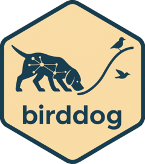

<!-- README.md is generated from README.Rmd. Please edit that file -->

# birddog <a href="https://roneyfraga.com/birddog/"></a>

<!-- badges: start -->

<!-- badges: end -->

The goal of `birddog` is sniffing out emergence and trajectories in
scientific and patent literature.

## Installation

Install the stable version from
[CRAN](https://cran.r-project.org/package=birddog):

``` r
install.packages("birddog")
library(birddog)
```

Or the development version from
[GitHub](https://github.com/roneyfraga/birddog/):

``` r
# install.packages("remotes")
remotes::install_github("roneyfraga/birddog")
library(birddog)
```

## Features

### Data import

- `read_openalex()` – OpenAlex API or CSV exports
- `read_wos()` – Web of Science BibTeX, RIS, plain-text, tab-delimited

### Citation network and community detection

- `sniff_network()` – direct citation or bibliographic coupling networks
- `sniff_components()` – identify connected components
- `sniff_groups()` – community detection (fast greedy, Louvain, Leiden,
  walktrap, edge betweenness)

### Group analysis

- `sniff_groups_attributes()` – group-level summary statistics and
  horizon plots
- `sniff_groups_keywords()` – keyword frequency per group
- `sniff_groups_terms()` – NLP-based phrase extraction
- `sniff_groups_hubs()` – hub classification (Zi-Pi, Guimera and Amaral
  2005)
- `sniff_groups_cumulative_citations()` – per-document citation growth
- `sniff_groups_influence()` – directed citation influence between
  groups: cross-citation matrix, debt / audience / Salton / surprise
  indices, net flow, and source / broker / sink roles
- `plot_groups_influence_matrix()` – directed influence heatmap, the
  asymmetric twin of the confluence matrix
- `plot_groups_influence_network()` – net-influence spine (who, on
  balance, leads whom)

### Indexes

- `sniff_cct()` – measures the pace of change (Kayal 1999)
- `sniff_entropy()` – normalized Shannon entropy for keyword diversity
  (Shannon 1948; Pielou 1966)

### Trajectory detection

- `sniff_groups_cumulative()` – cumulative clusterization over time
- `sniff_groups_lineage()` – Jaccard similarity DAG across years
- `plot_groups_lineage_2d()` / `plot_groups_lineage_3d()` – node-based
  lineage plots
- `sniff_trajectory_dag()` / `plot_trajectory_dag()` – temporal DAG of
  cluster-year nodes across the whole history
  (`plot_trajectory_dag_interactive()` for the plotly view);
  `similarity = "coupling"` routes the DAG by shared references instead
  of document overlap
- `sniff_trajectory_braid()` – decompose the DAG into trajectories: one
  central per final group (`tr::cNgN`) plus the absorbed tributaries
  that merge into it (`trN`)
- `sniff_trajectory_channel()` – sibling detector that routes one global
  optimal-path backbone per final group (potential-routed), an
  alternative decomposition of the same DAG
- `subset()` – focus a flow on a watershed or a predicate while it stays
  a valid flow (`subset(flow, target = "tr::c1g1")`)
- `is_flow()` / `validate_flow()` – test and validate the `birddog_flow`
  object contract
- `sniff_trajectory_coherence()` – score how content-coherent a flow’s
  partition is, with a silhouette over an independent content signal
- `sniff_trajectory_comparison()` – compare two detectors head-to-head
  by content coherence, reporting the contested nodes

### Trajectory analysis

- `sniff_trajectory_dynamics()` – per-trajectory dynamic-state
  indicators and life-cycle classification (emergence index, staying
  power, reach), with optional CCT, entropy, hubs and community lenses
  joined in
- `sniff_trajectory_cct()` – per-year citation cycle time (renewal pace)
  along each trajectory
- `sniff_trajectory_entropy()` – per-year keyword diversity (Pielou’s
  J’) along each trajectory
- `sniff_trajectory_hubs()` – hub roles aggregated to each trajectory
  (provincial vs bridging)
- `sniff_trajectory_community()` – community breadth (distinct authors)
  of each trajectory
- `sniff_trajectory_emergence_owners()` – the authors who own each
  living trajectory’s emergence
- `sniff_trajectory_self_sufficiency()` – per-trajectory
  endogenous-growth index (`1 - imported / size`)
- `sniff_trajectory_destination()` – track where a dying trajectory’s
  papers go, naming the trajectory that absorbed it
- `sniff_trajectory_formation()` – the inverse of destination: which
  trajectories fed into a target (its feeders)
- `sniff_trajectory_contribution()` – documents an intermediate
  trajectory contributes to a target in a given year
- `sniff_trajectory_confluence()` – render-ready confluence forest of
  the soft DAG (how the central trajectories form)

### Trajectory plots

- `plot_trajectory_dynamics()` /
  `plot_trajectory_dynamics_interactive()` – strategic map of trajectory
  dynamic states
- `plot_trajectory_confluence()` /
  `plot_trajectory_confluence_interactive()` /
  `plot_trajectory_confluence_matrix()` – braided-river confluence of
  the central trajectories
- `plot_trajectory_formation()` – confluence of feeders into a target
  trajectory (cumulative river timeline)
- `plot_trajectory_dispersion()` – timeline of the stagnant trajectory
  and the one that absorbed it
- `plot_trajectory_lines_2d()` / `plot_trajectory_lines_3d()` –
  variable-width trajectory line plots on a time layout

### Main path analysis

- `sniff_key_route()` – key-route search (Liu and Lu 2012) with SPC
  weights

### Topic modeling

- `sniff_groups_stm_prepare()` / `sniff_groups_stm_run()` – structural
  topic modeling within groups

## Vignettes

The vignettes are available online here:

- <https://roneyfraga.com/birddog/articles/introduction_birddog.html>
- [Interactive presentation
  (biogas)](https://roneyfraga.com/birddog-class)
- [AI Chat Assistant (biogas)](https://roneyfraga.com/birddog-chat)

## Methodological workflow


## Main publications

- [Miranda et
  al. (2025)](https://doi.org/10.1016/j.ijhydene.2025.01.089) The
  Landscape of Green and Biohydrogen Technology: A Data-Driven
  Exploration Using Non-Supervised Methods
- [Felizardo et
  al. (2025)](https://link.springer.com/article/10.1007/s12649-025-03136-z)
  Transforming Wastes into Resources: Innovations in Cotton
  Biorefineries for a Sustainable Future
- [Biazatti et
  al. (2024)](https://www.sciencedirect.com/science/article/pii/S221146452400112X)
  Soybean biorefinery and technological forecasts based on a
  bibliometric analysis and network mapping
- [Maria et al. (2023)](https://doi.org/10.3390/su15020967) Evolution of
  Green Finance: A Bibliometric Analysis through Complex Networks and
  Machine Learning
- [Matos et al. (2023)](https://doi.org/10.1007/s43938-023-00036-3)
  Building and evaluating prospective scenarios for corn-based
  biorefineries
- [Souza et al. (2022)](https://doi.org/10.14211/ibjesb.e1742) Is
  entrepreneurship an emerging area of research? A computational
  response
- [Souza et al. (2022)](https://doi.org/10.1002/bbb.2441) Bioenergy
  research in Brazil: A bibliometric evaluation of the BIOEN Research
  Program
