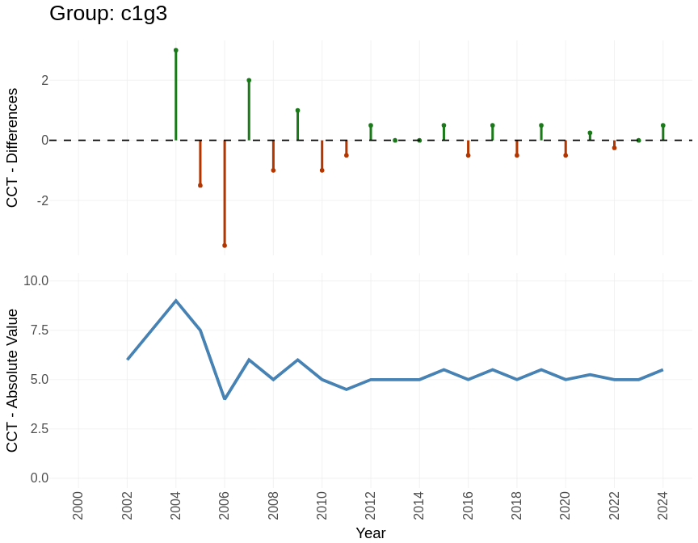
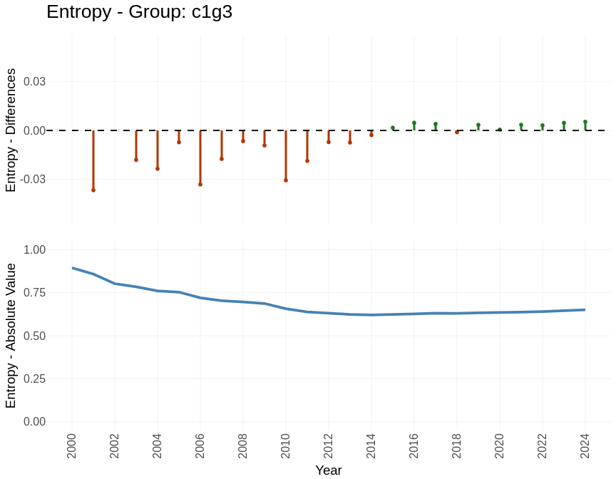
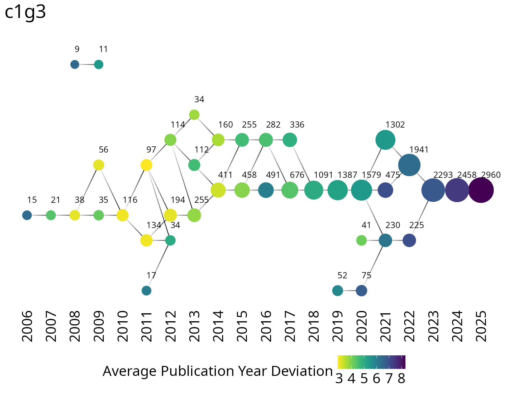
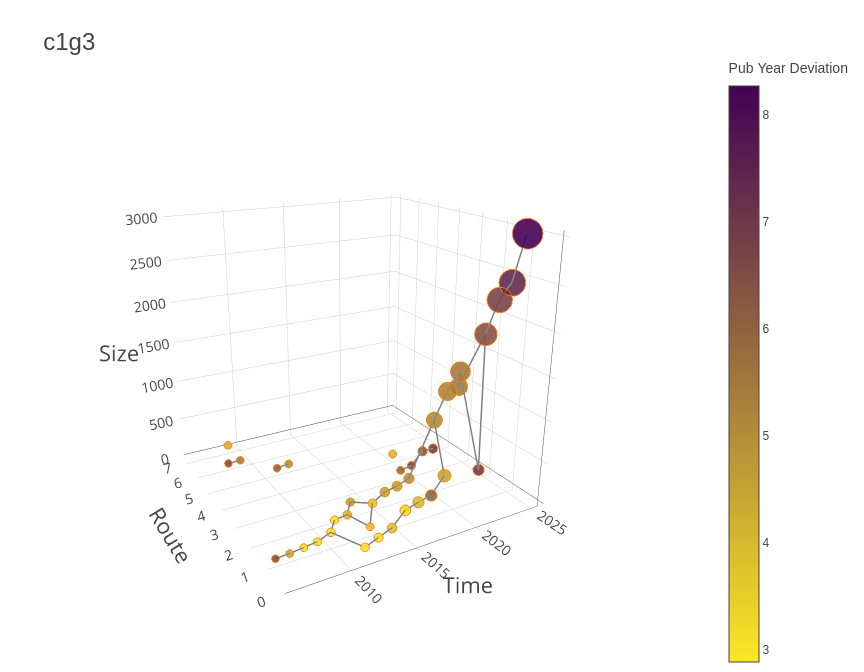
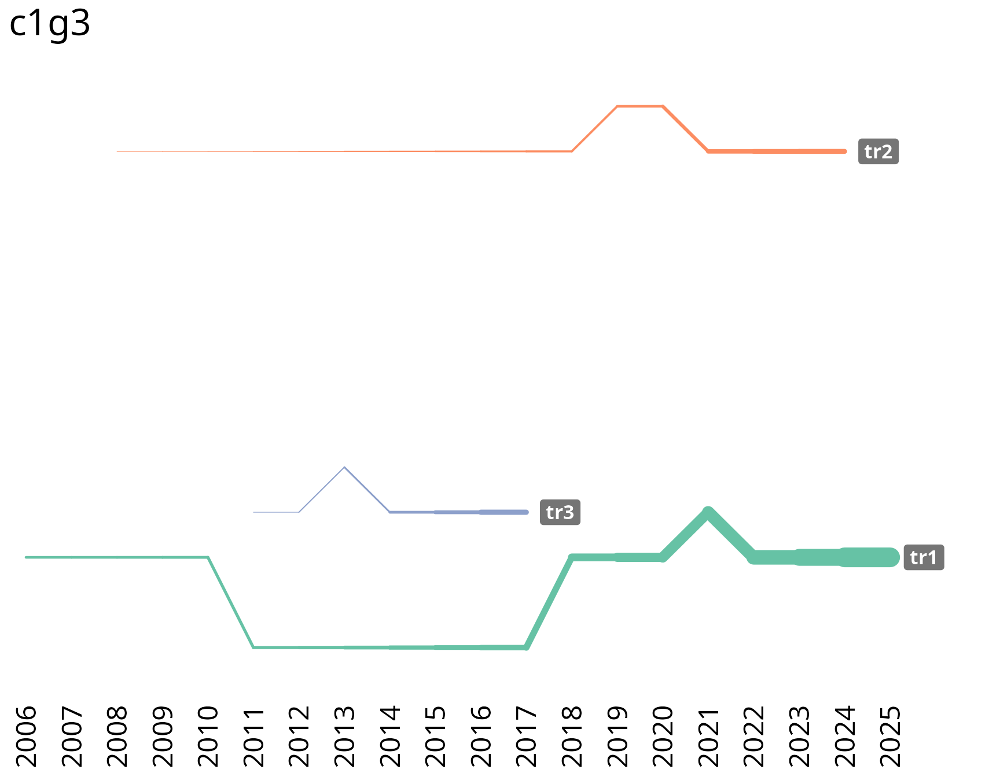
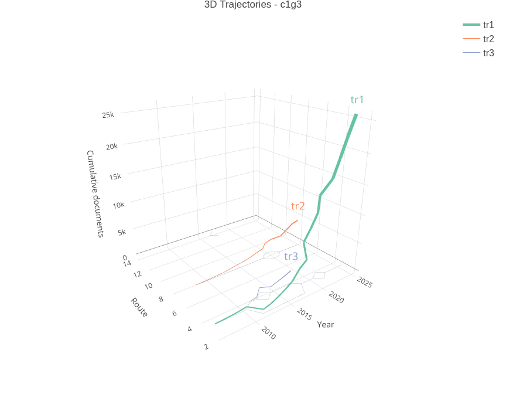
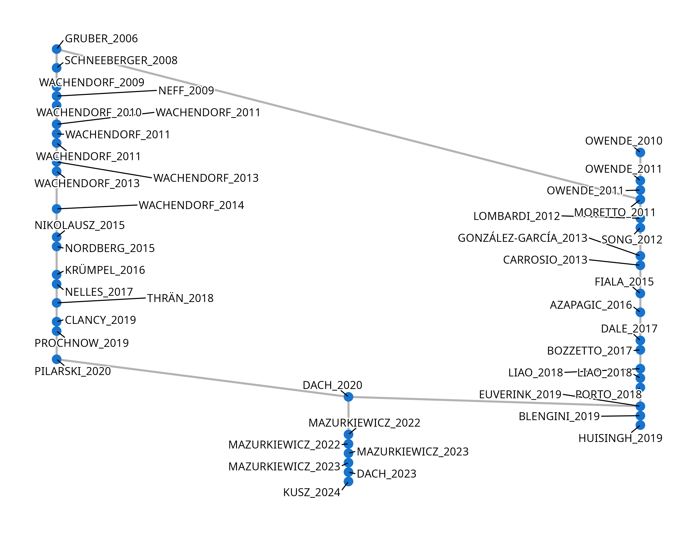

```{r, include = FALSE}
knitr::opts_chunk$set(
  collapse = TRUE,
  tidy = FALSE,
  comment = "#>",
  warning = FALSE,
  message = FALSE,
  fig.width = 9,
  fig.height = 7
)
set.seed(888L)
local_data <- "~/Sync/birddog/data-biogas/rawfiles-direct"
has_local_data <- dir.exists(local_data)
knitr::opts_chunk$set(eval = has_local_data)
# When local data is absent (e.g. CRAN), no chunk runs; the pre-built HTML ships instead.
```

## Overview

`birddog` helps you detect emergence and trace trajectories in scientific literature and patents.
It reads datasets from OpenAlex and Web of Science (WoS), builds citation-based networks, identifies groups, and summarizes their dynamics.

The stable release is on CRAN. The development version is available on GitHub: <https://github.com/roneyfraga/birddog>.

### Methodological workflow

{width=99%}

## Installation

```{r eval = FALSE}
# stable version (CRAN)
install.packages("birddog")

# development version (GitHub)
# install.packages("remotes")
remotes::install_github("roneyfraga/birddog")
```

```{r}
library(birddog)
```

## Data sources

`birddog` supports two main data sources:

- [OpenAlex](https://openalex.org/): browser search with CSV export, or API via `{openalexR}`.
- [Web of Science](https://www.webofscience.com/wos/woscc/smart-search): multiple export formats (`.bib`, `.ris`, plain-text `.txt`, tab-delimited `.txt`).

### OpenAlex via API or CSV

```{r eval = FALSE}
library(openalexR)

# Fetch works from OpenAlex API
url_api <- "https://api.openalex.org/works?page=1&filter=primary_location.source.id:s121026525"

openalexR::oa_request(query_url = url_api) |>
  openalexR::oa2df(entity = "works") |>
  birddog::read_openalex(format = "api") ->
  M

# Or from a CSV export
M <- birddog::read_openalex("path/to/openalex-export.csv", format = "csv")
```

### Web of Science (WoS)

```{r eval = FALSE}
# BibTeX
M <- birddog::read_wos("path/to/savedrecs.bib", format = "bib")

# RIS
M <- birddog::read_wos("path/to/savedrecs.ris", format = "ris")

# Plain text
M <- birddog::read_wos("path/to/savedrecs.txt", format = "txt-plain-text")

# Tab-delimited
M <- birddog::read_wos("path/to/savedrecs.txt", format = "txt-tab-delimited")
```

## Example dataset

We use a biogas dataset from OpenAlex with 57,734 documents as a running example.

```{r eval = FALSE}
# Download from OpenAlex (~15 min)
query_oa <- "( biogas )"

openalexR::oa_fetch(
  entity = "works",
  title_and_abstract.search = query_oa,
  verbose = TRUE
) ->
  papers

M <- birddog::read_openalex(papers, format = "api")
```

```{r eval = FALSE}
# Pre-computed dataset
url_m <- "https://roneyfraga.com/volume/keep_it/biogas-data/M.rds"
M <- readRDS(url(url_m))
```

```{r include = FALSE, }
M <- readRDS(file.path(local_data, "M.rds"))
```

```{r }
dplyr::glimpse(M)
```

## Citation network

Build a citation network to map the relationships between documents. Direct citation captures time-ordered influence; bibliographic coupling groups papers that share references.

```{r eval = FALSE}
net <- birddog::sniff_network(M, type = "direct citation")
```

```{r include = FALSE, }
net <- readRDS(file.path(local_data, "net.rds"))
```

```{r }
net |>
  tidygraph::activate(nodes) |>
  dplyr::select(name, AU, PY, TI, TC) |>
  dplyr::arrange(dplyr::desc(TC))
```

## Components

Identify connected components to eliminate disconnected documents that do not share the same bibliographic references.

```{r eval = FALSE}
comps <- birddog::sniff_components(net)
```

```{r include = FALSE, }
comps <- readRDS(file.path(local_data, "comps.rds"))
```

```{r }
comps$components |>
  dplyr::slice_head(n = 5) |>
  gt::gt()
```

## Groups (community detection)

Detect research communities within the citation network. Each group represents a cluster of related publications.

```{r eval = FALSE}
groups <- birddog::sniff_groups(
  comps,
  algorithm = "fast_greedy",
  min_group_size = 30,
  seed = 888L
)
```

```{r include = FALSE, }
groups <- readRDS(file.path(local_data, "groups.rds"))
```

```{r }
groups$aggregate |>
  gt::gt()
```

### Group attributes

Summarize group-level statistics including publication trends and growth rates.

```{r eval = FALSE}
# ~2 min
groups_attributes <- birddog::sniff_groups_attributes(
  groups,
  growth_rate_period = 2010:2024,
  show_results = FALSE
)

```

```{r include = FALSE, }
groups_attributes <- readRDS(file.path(local_data, "groups_attributes.rds"))
```

```{r }
groups_attributes$attributes_table
```

### Group keywords

Explore the most frequent keywords in each group.

```{r }
groups_keywords <- birddog::sniff_groups_keywords(groups)

groups_keywords |>
  dplyr::filter(group %in% c('c1g1', 'c1g2', 'c1g3')) |>
  gt::gt()
```

### Group NLP terms

Extract key phrases from abstracts using natural language processing.

```{r eval = FALSE}
# ~30 min
groups_terms <- birddog::sniff_groups_terms(groups, algorithm = "phrase")

```

```{r include = FALSE, }
groups_terms <- readRDS(file.path(local_data, "groups_terms.rds"))
```

```{r }
groups_terms$terms_table |>
  dplyr::slice_head(n = 3) |>
  gt::gt()
```

### Hubs

Classify documents by their role in the network using the Zi-Pi method. Hub documents connect different research communities.

```{r eval = FALSE}
# ~20 min
groups_hubs <- birddog::sniff_groups_hubs(groups)

```

```{r include = FALSE, }
groups_hubs <- readRDS(file.path(local_data, "groups_hubs.rds"))
```

```{r }
groups_hubs |>
  dplyr::filter(zone != "noHub") |>
  dplyr::mutate(Zi = round(Zi, 2), Pi = round(Pi, 2)) |>
  dplyr::arrange(dplyr::desc(zone), dplyr::desc(Zi)) |>
  dplyr::slice_head(n = 15) |>
  gt::gt() |>
  gt::text_transform(
    locations = gt::cells_body(columns = name),
    fn = function(x) {
      glue::glue('<a href="https://openalex.org/{x}" target="_blank">{x}</a>')
    }
  )
```

## Indexes: Citations Cycle Time

Measure the pace of change in each group by tracking how old the cited references are over time.

```{r eval = FALSE}
# ~1.5 min
groups_cct <- birddog::sniff_citations_cycle_time(
  groups,
  scope = "groups",
  start_year = 2000,
  end_year = 2024
)

groups_cct$plots[["c1g3"]]
```

```{r include = FALSE, }
groups_cct <- readRDS(file.path(local_data, "groups_cct.rds"))
```



## Indexes: Entropy

Track keyword diversity within each group over time. Increasing entropy signals thematic diversification; decreasing entropy signals convergence.

```{r eval = FALSE}
groups_entropy <- birddog::sniff_entropy(
  groups,
  scope = "groups",
  start_year = 2000,
  end_year = 2024
)

groups_entropy$plots[["c1g3"]]
```



## Group trajectories

Track how research communities evolve over time by building cumulative networks at each year and following groups through consecutive periods.

```{r eval = FALSE}
# ~2 min
groups_cumulative <- birddog::sniff_groups_cumulative(groups)

```

```{r include = FALSE, }
groups_cumulative <- readRDS(file.path(local_data, "groups_cumulative.rds"))
```

```{r eval = FALSE}
suppressMessages({
  groups_cumulative_trajectories <- birddog::sniff_groups_trajectories(groups_cumulative)
})

birddog::plot_group_trajectories_2d(
  groups_cumulative_trajectories,
  group = "c1g3",
  label_vertical_position = -2
)

birddog::plot_group_trajectories_3d(
  groups_cumulative_trajectories,
  group = "c1g3"
)

```

{width=99%}


### Trajectory detection and variable-width lines

Automatically detect the highest-scoring temporal paths within a group using dynamic programming, then display them as variable-width lines that grow with cumulative paper counts.

```{r eval = FALSE, warning = FALSE}
traj_data <- birddog::detect_main_trajectories(
  groups_cumulative_trajectories,
  group = "c1g3"
)

traj_filtered <- birddog::filter_trajectories(
  traj_data$trajectories,
  top_n = 3
)

birddog::plot_group_trajectories_lines_2d(
  traj_data = traj_data,
  traj_filtered = traj_filtered,
  title = "c1g3"
)

birddog::plot_group_trajectories_lines_3d(
  traj_data = traj_data,
  traj_filtered = traj_filtered,
  group_id = "c1g3"
)
```

{width=99%}


## Citation growth per document

Track how individual documents accumulate citations over time to identify fast-growing papers.

```{r eval = FALSE}
# ~11 min
groups_cumulative_citations <- birddog::sniff_groups_cumulative_citations(
  groups,
  min_citations = 2
)

```

## Main Path Analysis

Identify the key route through the citation network, revealing the most influential chain of documents over time.

```{r eval = FALSE}

groups_key_route <- birddog::sniff_key_route(groups, scope = "groups")

groups_key_route[["c1g3"]]$plot

groups_key_route[["c1g3"]]$data |>
  dplyr::select(-name) |>
  gt::gt()
```

{width=99%}

```{r include = FALSE, }
key_route_c1g3_data <- readRDS(file.path(local_data, "key_route_c1g3_data.rds"))
```

```{r }
key_route_c1g3_data |>
  dplyr::select(document = name, name2, title = TI) |>
  gt::gt() |>
  gt::text_transform(
    locations = gt::cells_body(columns = document),
    fn = function(x) {
      glue::glue('<a href="https://openalex.org/{x}" target="_blank">{x}</a>')
    }
  )
```

## Topic modeling (STM)

Detect topics within a group using Structural Topic Modeling, creating sub-groups based on linguistic similarities.

```{r eval = FALSE}
# Prepare STM data (~30 min)
groups_stm_prepare <- birddog::sniff_groups_stm_prepare(
  groups,
  group_to_stm = "c1g3"
)
```

```{r include = FALSE, }
groups_stm_prepare <- readRDS(file.path(local_data, "groups_stm_prepare.rds"))
```

**17 topics** is the best fit.

```{r eval = FALSE}
groups_stm_prepare$plots[['metrics_by_k']]
groups_stm_prepare$plots[['exclusivity_vs_coherence']]
```

```{r eval = FALSE}
# Run STM (~35 sec)
groups_stm_run <- birddog::sniff_groups_stm_run(
  groups_stm_prepare,
  k_topics = 17,
  n_top_documents = 20
)
```

```{r eval = FALSE}
groups_stm_run$topic_proportion |>
  dplyr::mutate(topic_proportion = round(topic_proportion, 3)) |>
  gt::gt()

groups_stm_run$top_documents |>
  dplyr::group_by(topic) |>
  dplyr::arrange(dplyr::desc(gamma)) |>
  dplyr::slice_head(n = 3) |>
  dplyr::select(-DI) |>
  gt::gt() |>
  gt::text_transform(
    locations = gt::cells_body(columns = document),
    fn = function(x) {
      glue::glue('<a href="https://openalex.org/{x}" target="_blank">{x}</a>')
    }
  )
```

## Session info

```{r}
sessionInfo()
```

## Hardware

- Hostname: `r Sys.info()[["nodename"]]`
- Processor: `r tryCatch(benchmarkme::get_cpu()[[2]], error = function(e) "N/A")`
- RAM: `r tryCatch(paste0(round(as.numeric(benchmarkme::get_ram()) / 1073741824, digits = 1), " GB"), error = function(e) "N/A")`
- Storage: 2 SSD’s in `raid0` for data and 1 SSD for the OS.
