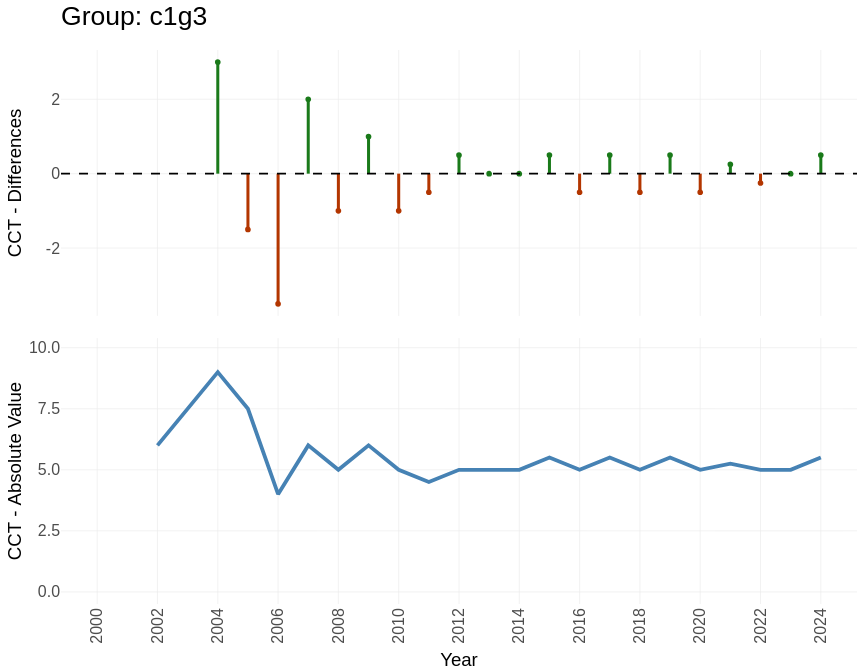
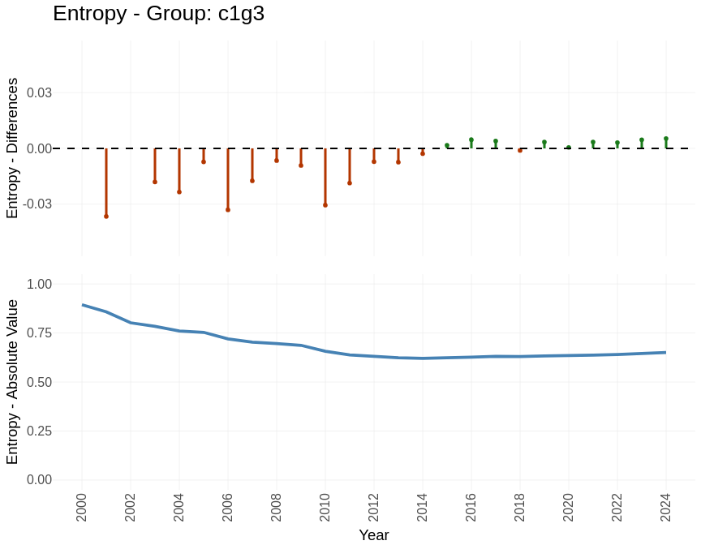
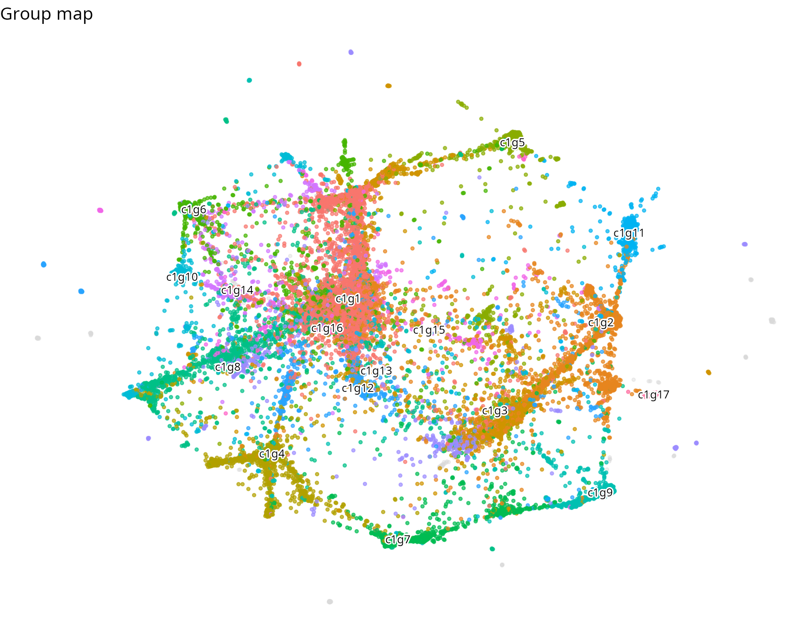
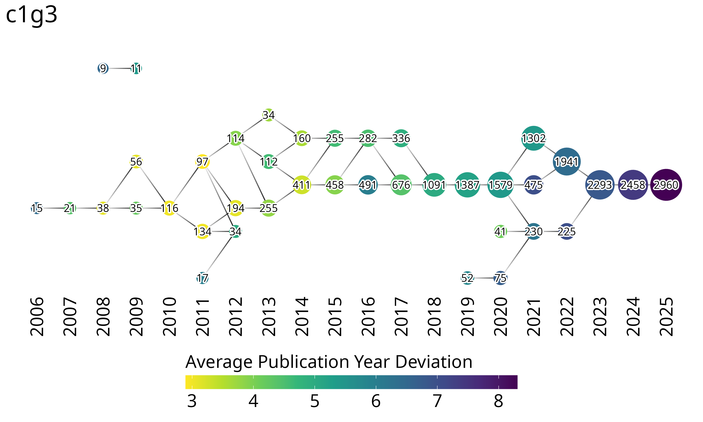
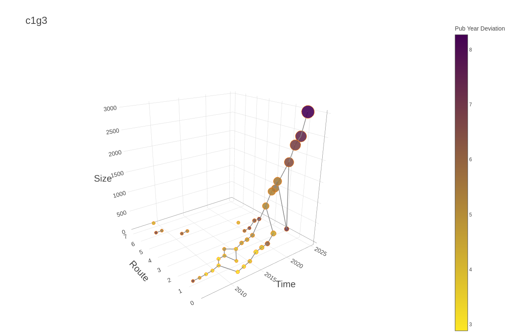
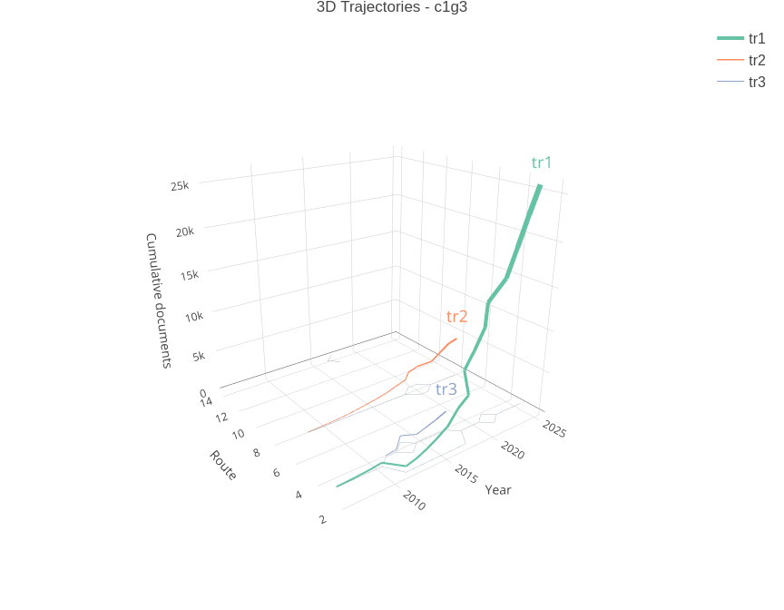
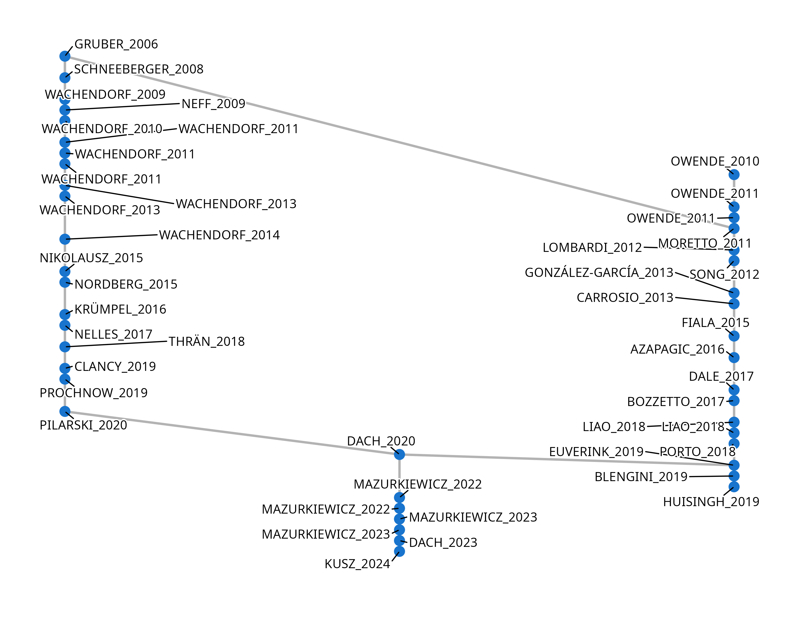

```{r, include = FALSE}
knitr::opts_chunk$set(
  collapse = TRUE,
  tidy = FALSE,
  comment = "#>",
  warning = FALSE,
  message = FALSE,
  fig.width = 9,
  fig.height = 7
)
set.seed(888L)
local_data <- "~/Sync/birddog/data-biogas/rawfiles-direct"
has_local_data <- dir.exists(local_data)
knitr::opts_chunk$set(eval = has_local_data)
# When local data is absent (e.g. CRAN), no chunk runs; the pre-built HTML ships instead.
```

## Overview

`birddog` helps you detect emergence and trace trajectories in scientific literature and patents.
It reads datasets from OpenAlex and Web of Science (WoS), builds citation-based networks, identifies groups, and summarizes their dynamics.

The stable release is on CRAN. The development version is available on GitHub: <https://github.com/roneyfraga/birddog>.

### Methodological workflow

{width=99%}

## Installation

```{r eval = FALSE}
# stable version (CRAN)
install.packages("birddog")

# development version (GitHub)
# install.packages("remotes")
remotes::install_github("roneyfraga/birddog")
```

```{r}
library(birddog)
```

## Data sources

`birddog` supports two main data sources:

- [OpenAlex](https://openalex.org/): browser search with CSV export, or API via `{openalexR}`.
- [Web of Science](https://www.webofscience.com/wos/woscc/smart-search): multiple export formats (`.bib`, `.ris`, plain-text `.txt`, tab-delimited `.txt`).

### OpenAlex via API or CSV

```{r eval = FALSE}
library(openalexR)

# Fetch works from OpenAlex API
url_api <- "https://api.openalex.org/works?page=1&filter=primary_location.source.id:s121026525"

openalexR::oa_request(query_url = url_api) |>
  openalexR::oa2df(entity = "works") |>
  birddog::read_openalex(format = "api") ->
  M

# Or from a CSV export
M <- birddog::read_openalex("path/to/openalex-export.csv", format = "csv")
```

### Web of Science (WoS)

```{r eval = FALSE}
# BibTeX
M <- birddog::read_wos("path/to/savedrecs.bib", format = "bib")

# RIS
M <- birddog::read_wos("path/to/savedrecs.ris", format = "ris")

# Plain text
M <- birddog::read_wos("path/to/savedrecs.txt", format = "txt-plain-text")

# Tab-delimited
M <- birddog::read_wos("path/to/savedrecs.txt", format = "txt-tab-delimited")
```

## Example dataset

We use a biogas dataset from OpenAlex with 57,734 documents as a running example.

```{r eval = FALSE}
# Download from OpenAlex (~15 min)
query_oa <- "( biogas )"

openalexR::oa_fetch(
  entity = "works",
  title_and_abstract.search = query_oa,
  verbose = TRUE
) ->
  papers

M <- birddog::read_openalex(papers, format = "api")
```

```{r eval = FALSE}
# Pre-computed dataset
url_m <- "https://roneyfraga.com/volume/keep_it/biogas-data/M.rds"
M <- readRDS(url(url_m))
```

```{r include = FALSE, }
M <- readRDS(file.path(local_data, "M.rds"))
```

```{r }
dplyr::glimpse(M)
```

## Citation network

Build a citation network to map the relationships between documents. Direct citation captures time-ordered influence; bibliographic coupling groups papers that share references.

```{r eval = FALSE}
net <- birddog::sniff_network(M, type = "direct citation")
```

```{r include = FALSE, }
net <- readRDS(file.path(local_data, "net.rds"))
```

```{r }
net |>
  tidygraph::activate(nodes) |>
  dplyr::select(name, AU, PY, TI, TC) |>
  dplyr::arrange(dplyr::desc(TC))
```

## Components

Identify connected components to eliminate disconnected documents that do not share the same bibliographic references.

```{r eval = FALSE}
comps <- birddog::sniff_components(net)
```

```{r include = FALSE, }
comps <- readRDS(file.path(local_data, "comps.rds"))
```

```{r }
comps$components |>
  dplyr::slice_head(n = 5) |>
  gt::gt()
```

## Groups (community detection)

Detect research communities within the citation network. Each group represents a cluster of related publications.

```{r eval = FALSE}
groups <- birddog::sniff_groups(
  comps,
  algorithm = "fast_greedy",
  min_group_size = 30,
  seed = 888L
)
```

```{r include = FALSE, }
groups <- readRDS(file.path(local_data, "groups.rds"))
```

```{r }
groups$aggregate |>
  gt::gt()
```

### Group attributes

Summarize group-level statistics including publication trends and growth rates.

```{r eval = FALSE}
# ~2 min
groups_attributes <- birddog::sniff_groups_attributes(
  groups,
  growth_rate_period = 2010:2024,
  show_results = FALSE
)

```

```{r include = FALSE, }
groups_attributes <- readRDS(file.path(local_data, "groups_attributes.rds"))
```

```{r }
groups_attributes$attributes_table
```

### Group keywords

Explore the most frequent keywords in each group.

```{r }
groups_keywords <- birddog::sniff_groups_keywords(groups)

groups_keywords |>
  dplyr::filter(group %in% c('c1g1', 'c1g2', 'c1g3')) |>
  gt::gt()
```

### Group NLP terms

Extract key phrases from abstracts using natural language processing.

```{r eval = FALSE}
# ~30 min
groups_terms <- birddog::sniff_groups_terms(groups, algorithm = "phrase")

```

```{r include = FALSE, }
groups_terms <- readRDS(file.path(local_data, "groups_terms.rds"))
```

```{r }
groups_terms$terms_table |>
  dplyr::slice_head(n = 3) |>
  gt::gt()
```

### Hubs

Classify documents by their role in the network using the Zi-Pi method. Hub documents connect different research communities.

```{r eval = FALSE}
# ~20 min
groups_hubs <- birddog::sniff_groups_hubs(groups)

```

```{r include = FALSE, }
groups_hubs <- readRDS(file.path(local_data, "groups_hubs.rds"))
```

```{r }
groups_hubs |>
  dplyr::filter(zone != "noHub") |>
  dplyr::mutate(Zi = round(Zi, 2), Pi = round(Pi, 2)) |>
  dplyr::arrange(dplyr::desc(zone), dplyr::desc(Zi)) |>
  dplyr::slice_head(n = 15) |>
  gt::gt() |>
  gt::text_transform(
    locations = gt::cells_body(columns = name),
    fn = function(x) {
      glue::glue('<a href="https://openalex.org/{x}" target="_blank">{x}</a>')
    }
  )
```

### Group influence

`sniff_groups_influence()` lifts the internal citations to the group level and measures how much each group's output flows into every other's. Influence is directional -- if group B's papers cite group A's, knowledge flows A to B -- so the cross-citation matrix is asymmetric, the directed twin of the confluence matrix. Each ordered pair carries four size-corrected indices (debt, audience, Salton, surprise); the net flow (citations one way minus the reciprocal) and the balance (received minus made) classify every group as a source, a broker or a sink.

```{r }
influence <- birddog::sniff_groups_influence(groups)

influence$groups |>
  gt::gt()
```

`plot_groups_influence_matrix()` is the directed counterpart of `plot_trajectory_confluence_matrix()`: rows are the citing group ("is influenced"), columns the cited group ("the influencer"), and a cell and its mirror across the diagonal are the two directions of one pair. Because intra-group citation dominates, `self = FALSE` drops the diagonal and sharpens the between-group surprise.

```{r }
influence_between <- birddog::sniff_groups_influence(groups, self = FALSE)

birddog::plot_groups_influence_matrix(influence_between, fill = "surprise", x_angle = 45)
```

`plot_groups_influence_network()` renders the same net flow as a node-link spine rather than a matrix: an arrow from each source to the group it leads, with nodes coloured by role and edges weighted by the net flow -- the backbone view that complements the cell-by-cell matrix above.

## Indexes

`birddog` tracks each group's pace of change and thematic spread as year-by-year indexes.

### Citation Cycle Time

Measure the pace of change in each group by tracking how old the cited references are over time.

```{r eval = FALSE}
# ~1.5 min
groups_cct <- birddog::sniff_cct(
  groups,
  scope = "groups",
  start_year = 2000,
  end_year = 2024
)

groups_cct$plots[["c1g3"]]
```

```{r include = FALSE, }
groups_cct <- readRDS(file.path(local_data, "groups_cct.rds"))
```



### Entropy

Track keyword diversity within each group over time. Increasing entropy signals thematic diversification; decreasing entropy signals convergence.

```{r eval = FALSE}
groups_entropy <- birddog::sniff_entropy(
  groups,
  scope = "groups",
  start_year = 2000,
  end_year = 2024
)

groups_entropy$plots[["c1g3"]]
```



## Group lineage

Groups are a stock: each year's community is recomputed from scratch. To trace how a community evolves, `birddog` builds cumulative networks year by year and tracks each final-year group backwards through the earlier cuts.

```{r eval = FALSE}
# ~2 min
groups_cumulative <- birddog::sniff_groups_cumulative(groups)

```

```{r include = FALSE, }
groups_cumulative <- readRDS(file.path(local_data, "groups_cumulative.rds"))
```

`plot_groups_map()` lays out the final cumulative network and colours every document by its group.

```{r eval = FALSE}
birddog::plot_groups_map(groups_cumulative)
```


`sniff_groups_lineage()` tracks each final-year group backwards through the cumulative cuts; `plot_groups_lineage_2d()` and `plot_groups_lineage_3d()` draw one group's lineage at a time.

```{r eval = FALSE}
suppressMessages({
  groups_lineage <- birddog::sniff_groups_lineage(groups_cumulative)
})

birddog::plot_groups_lineage_2d(
  groups_lineage,
  group = "c1g3",
  label_vertical_position = -2
)

birddog::plot_groups_lineage_3d(
  groups_lineage,
  group = "c1g3"
)

```

{width=99%}


## Trajectories

The lineage view follows one group at a time. Trajectories are a flow: `sniff_trajectory_dag()` reads the whole cumulative-clustering history at once and builds the temporal DAG of cluster-year nodes.

```{r include = FALSE, }
groups_lineage <- readRDS(file.path(local_data, "groups_cumulative_trajectories.rds"))
```

```{r }
dag <- birddog::sniff_trajectory_dag(groups_lineage)

dag
```

`plot_groups_per_year()` counts the groups alive in each yearly cut; `plot_trajectory_dag()` draws the full node-and-edge DAG.

```{r }
birddog::plot_groups_per_year(dag)

birddog::plot_trajectory_dag(dag)
```

### Braid

`sniff_trajectory_braid()` decomposes that DAG into trajectories. A trajectory that reaches the final year is **central** (one per final group, named `tr::c1g1`, `tr::c1g2`, and so on). Every other trajectory is **intermediate** (`tr1` ... `trN`, stored as `type == "absorbed"`): it merges into a central one before the end. Groups are stock, trajectories are flow.

```{r }
braid <- birddog::sniff_trajectory_braid(dag)

braid
```

`braid$trajectories` has one row per trajectory. Absorption is transitive, so the intermediate trajectories form a confluence tree under the centrals.

`subset()` focuses a flow on a watershed -- a central trajectory and its whole tributary subtree -- or on any predicate over `braid$trajectories`, and the result is still a valid flow (the pruning call is recorded and shown when you print it).

```{r }
# keep the central of group c1g3 and every trajectory that feeds it
watershed <- subset(braid, target = "tr::c1g3")

watershed
```

### Channel

`sniff_trajectory_channel()` is a sibling detector over the same DAG. Instead of braiding tributaries into each central, it routes one global optimal-path backbone per final group, an alternative decomposition that keeps the same `birddog_flow` contract.

```{r }
channel <- birddog::sniff_trajectory_channel(dag)

channel
```

### Confluence

`sniff_trajectory_confluence()` turns the flow into render-ready data and `plot_trajectory_confluence()` draws the whole forest: each central trajectory is a river, each intermediate trajectory a tributary merging in at its handoff year.

```{r }
conf <- birddog::sniff_trajectory_confluence(braid)

birddog::plot_trajectory_confluence(conf, target = c('tr::c1g1', 'tr::c1g2', 'tr::c1g3'))
```

### Trajectory lines

`plot_trajectory_lines_2d()` is the line counterpart of the confluence delta: every trajectory is a variable-width line on the year-aware Sugiyama layout, widening with the documents it accumulates. Targeting a central draws it and the trajectories that feed it; the legend reports how many papers of each feeder's terminal cohort reached the final group. Where `plot_trajectory_confluence(conf, target = ...)` keeps only the direct tributaries (`depth = 1`), the lines view follows the whole tributary subtree -- feeders and feeders of feeders -- so a targeted central shows more lines here than in the confluence delta. Open the delta to every depth with `plot_trajectory_confluence(conf, target = "tr::c1g3", depth = Inf)`.

```{r }
birddog::plot_trajectory_lines_2d(braid, target = "tr::c1g3")
```

`plot_trajectory_lines_3d()` is the interactive plotly version of the same view: x = year, y = route (the Sugiyama branching coordinate), z = cumulative tracked documents.

```{r eval = FALSE}
birddog::plot_trajectory_lines_3d(braid, target = "tr::c1g3")
```



### Where an intermediate trajectory's papers go

A trajectory can stop before the final year, but with cumulative clustering its papers never leave the network: they are re-grouped each year. `sniff_trajectory_destination()` follows a trajectory's terminal cohort forward and reports where the papers land, split by final group. Here `tr9` (2011-2017, handed off in 2018) is mostly captured by group `c1g3`: 336 of its 502 terminal papers end in `c1g3`'s final community, and none drop out of the network.

```{r }
# where do the papers of trajectory tr9 go?
dest <- birddog::sniff_trajectory_destination(braid, source = "tr9")

dest$destination

birddog::plot_trajectory_dispersion(dest)
```

### Which trajectories formed a central one

The mirror of the previous analysis: stand at a central trajectory and ask which trajectories fed into it. `sniff_trajectory_formation()` returns the target's direct tributaries in the confluence tree. `plot_trajectory_formation()` draws the target as a cumulative river with each feeder merging at its handoff year. Two feeders formed `tr::c1g3`: `tr9`, handed off in 2018, and `tr14`, handed off in 2022; the labels count each feeder's papers that sit in the target's final community.

```{r }
# which trajectories formed the central trajectory of group c1g3?
form <- birddog::sniff_trajectory_formation(braid, target = "tr::c1g3")

form$feeders

birddog::plot_trajectory_formation(form, max_feeders = 8)
```

### Documents transferred

`sniff_trajectory_destination()` and `sniff_trajectory_formation()` count the papers that crossed; `sniff_trajectory_contribution()` lists them. Given an intermediate trajectory, the year of its terminal cohort, and a central target, it returns one row per document with `in_target` flagging those that reached the target's final-year community.

```{r }
# the terminal-cohort year of tr9 (its last node)
yr <- max(as.integer(sub("^y(\\d{4}).*", "\\1",
  braid$trajectories$nodes[[which(braid$trajectories$traj_id == "tr9")]])))

contrib <- birddog::sniff_trajectory_contribution(
  braid,
  source = "tr9",
  year = yr,
  target = "tr::c1g3"
)

contrib |>
  dplyr::summarise(documents = dplyr::n(), in_target = sum(in_target))
```

### Self-sufficiency

How much of each central trajectory grew on its own versus being a confluence of others? `sniff_trajectory_self_sufficiency()` reports the share of each central trajectory's final-year community that was not delivered by an intermediate tributary: values near 1 mean the lineage grew endogenously; lower values mean it absorbed many documents from other communities.

```{r }
ss <- birddog::sniff_trajectory_self_sufficiency(braid)

ss |>
  dplyr::mutate(self_sufficiency = round(self_sufficiency, 2)) |>
  dplyr::slice_head(n = 10) |>
  gt::gt()
```

### Trajectory dynamics

`sniff_trajectory_dynamics()` computes growth, novelty, recruitment and destination indicators per trajectory, then classifies each one into a dynamic state. Emergence: a central trajectory growing fast with a high share of recent papers. Convergence: an intermediate trajectory whose terminal cohort concentrates in a single central one. Divergence: an intermediate trajectory whose cohort scatters across several. Dormancy: a central trajectory that stalled, or an intermediate one whose cohort mostly drops out of the network. Central trajectories in between are classified as maturity.

```{r }
dyn <- birddog::sniff_trajectory_dynamics(braid)

birddog::plot_trajectory_dynamics(dyn)
```

### Per-trajectory lenses

`sniff_trajectory_dynamics()` left-joins optional lenses, each recomputed from the trajectory's own documents and supplied as a per-year list-column: renewal pace (`sniff_trajectory_cct()`), keyword diversity (`sniff_trajectory_entropy()`) and hub roles (`sniff_trajectory_hubs()`). They are built from the corpus fields keyed by document id.

```{r }
keywords <- M |>
  dplyr::transmute(document_id = SR, keyword = DE) |>
  tidyr::separate_rows(keyword, sep = ";") |>
  dplyr::mutate(keyword = trimws(keyword)) |>
  dplyr::filter(keyword != "")

references <- M |>
  dplyr::transmute(document_id = SR, PY, CR) |>
  tidyr::separate_rows(CR, sep = ";") |>
  dplyr::mutate(CR = trimws(CR)) |>
  dplyr::filter(CR != "") |>
  dplyr::left_join(
    dplyr::distinct(groups_cct$tracked_cr_py, CR, .keep_all = TRUE), by = "CR") |>
  dplyr::filter(!is.na(CR_PY), PY > CR_PY) |>
  dplyr::transmute(document_id, ref_age = PY - CR_PY)

dyn <- birddog::sniff_trajectory_dynamics(
  braid,
  cct = birddog::sniff_trajectory_cct(braid, references),
  entropy = birddog::sniff_trajectory_entropy(braid, keywords),
  hubs = birddog::sniff_trajectory_hubs(braid, groups_hubs)
)
```

`sniff_trajectory_emergence_owners()` then credits each central trajectory's emergence to its authors, surfacing the field's leaders.

```{r }
authors <- M |>
  dplyr::transmute(document_id = SR, author = AU) |>
  tidyr::separate_rows(author, sep = ";") |>
  dplyr::mutate(author = trimws(author)) |>
  dplyr::filter(author != "")

birddog::sniff_trajectory_emergence_owners(braid, dyn, authors) |>
  dplyr::mutate(total = round(total, 2), norm = round(norm, 2)) |>
  dplyr::slice_head(n = 10) |>
  gt::gt()
```

## Citation growth per document

Track how individual documents accumulate citations over time to identify fast-growing papers.

```{r eval = FALSE}
# ~11 min
groups_cumulative_citations <- birddog::sniff_groups_cumulative_citations(
  groups,
  min_citations = 2
)

```

## Main Path Analysis

Identify the key route through the citation network, revealing the most influential chain of documents over time.

```{r eval = FALSE}

groups_key_route <- birddog::sniff_key_route(groups, scope = "groups")

groups_key_route[["c1g3"]]$plot

groups_key_route[["c1g3"]]$data |>
  dplyr::select(-name) |>
  gt::gt()
```

{width=99%}

```{r include = FALSE, }
key_route_c1g3_data <- readRDS(file.path(local_data, "key_route_c1g3_data.rds"))
```

```{r }
key_route_c1g3_data |>
  dplyr::select(document = name, name2, title = TI) |>
  gt::gt() |>
  gt::text_transform(
    locations = gt::cells_body(columns = document),
    fn = function(x) {
      glue::glue('<a href="https://openalex.org/{x}" target="_blank">{x}</a>')
    }
  )
```

## Topic modeling (STM)

Detect topics within a group using Structural Topic Modeling, creating sub-groups based on linguistic similarities.

```{r eval = FALSE}
# Prepare STM data (~30 min)
groups_stm_prepare <- birddog::sniff_groups_stm_prepare(
  groups,
  group_to_stm = "c1g3"
)
```

```{r include = FALSE, }
groups_stm_prepare <- readRDS(file.path(local_data, "groups_stm_prepare.rds"))
```

**17 topics** is the best fit.

```{r eval = FALSE}
groups_stm_prepare$plots[['metrics_by_k']]
groups_stm_prepare$plots[['exclusivity_vs_coherence']]
```

```{r eval = FALSE}
# Run STM (~35 sec)
groups_stm_run <- birddog::sniff_groups_stm_run(
  groups_stm_prepare,
  k_topics = 17,
  n_top_documents = 20
)
```

```{r eval = FALSE}
groups_stm_run$topic_proportion |>
  dplyr::mutate(topic_proportion = round(topic_proportion, 3)) |>
  gt::gt()

groups_stm_run$top_documents |>
  dplyr::group_by(topic) |>
  dplyr::arrange(dplyr::desc(gamma)) |>
  dplyr::slice_head(n = 3) |>
  dplyr::select(-DI) |>
  gt::gt() |>
  gt::text_transform(
    locations = gt::cells_body(columns = document),
    fn = function(x) {
      glue::glue('<a href="https://openalex.org/{x}" target="_blank">{x}</a>')
    }
  )
```

## Session info

```{r}
sessionInfo()
```

## Hardware

- Hostname: `r Sys.info()[["nodename"]]`
- Processor: `r tryCatch(benchmarkme::get_cpu()[[2]], error = function(e) "N/A")`
- RAM: `r tryCatch(paste0(round(as.numeric(benchmarkme::get_ram()) / 1073741824, digits = 1), " GB"), error = function(e) "N/A")`
- Storage: 2 SSD’s in `raid0` for data and 1 SSD for the OS.
